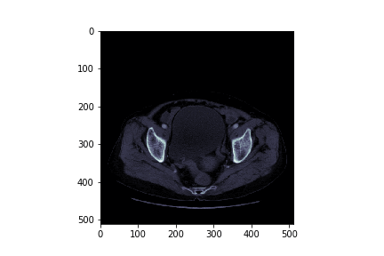
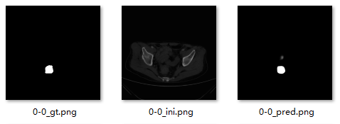
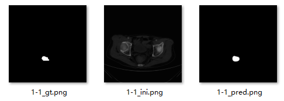
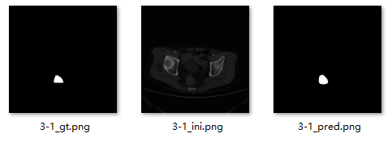
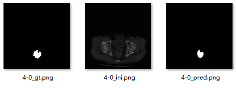

# Taidi_7th_B
第七届“泰迪杯”数据挖掘挑战赛   B题：**直肠癌淋巴结转移的智能诊断**  

初学小白的解决方案：使用**U-net**进行肿瘤预测

# How to Use

- 运行`generate_train.py`获得训练集
- 运行`generate_test.py`获得验证集
- 运行`train.py`训练模型，模型结果保存于`models/`
- 运行`test.py`实现预测，预测结果保存于`preds/`
- 注1：`test.py`直接使用验证集进行预测（目的是直观查看模型预测效果），实际中得自己再制作测试集，实现方法同`generate_test.py`,具体实现见`result_generate.py`
- 注2：理解代码可见原博，也可查看`助于理解代码的实验.ipynb`，我做了一些可视化助于理解~
- 注3：使用自己制定测试集预测，依次修改运行`result_generate.py`,`result_test.py`,`result_test.py`即可（较易懂）。

# Result

`dice_coef` = 0.8

### **预测结果展示**	

（这里使用验证集 qwq）

> 注: 	  		gt 为 groundTruth,  		  pred 为 模型预测结果

# Reference

- [医学图像分割 基于深度学习的肝脏肿瘤分割 实战(一）](<https://blog.csdn.net/normol/article/details/88778250>)
- [3Dircadb_Use_Unet](<https://github.com/Cooper111/3Dircadb_Use_Unet>)